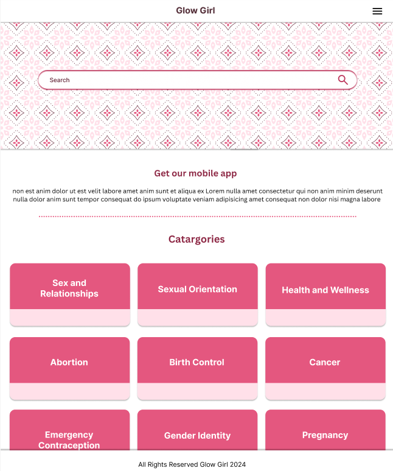
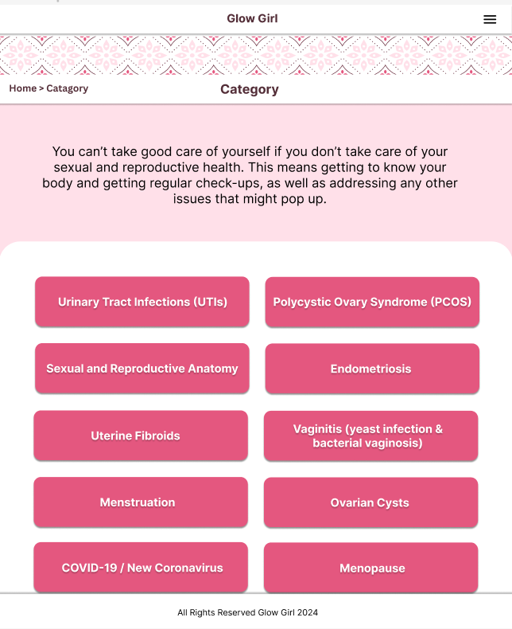
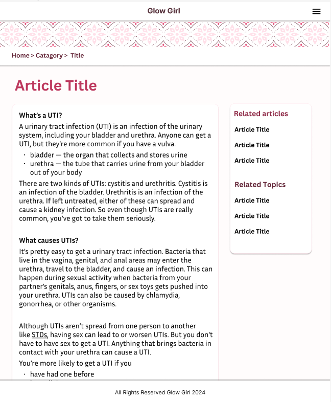
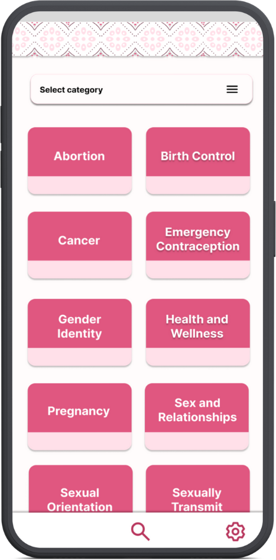
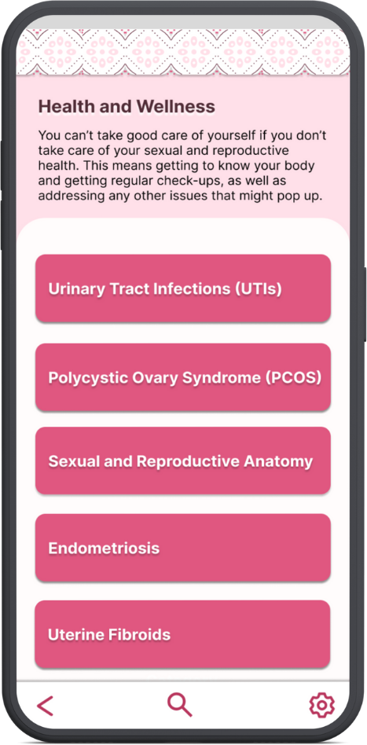
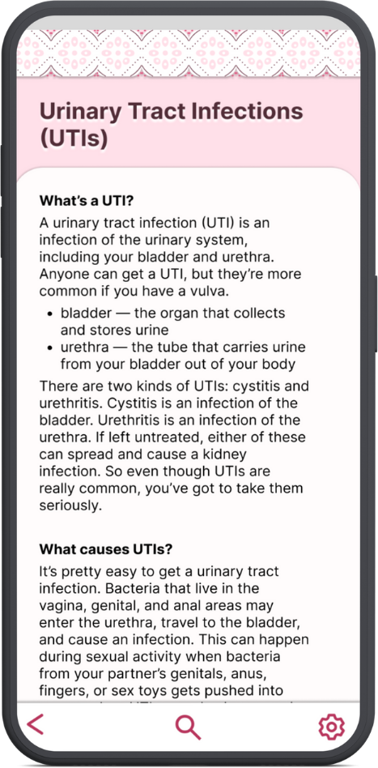
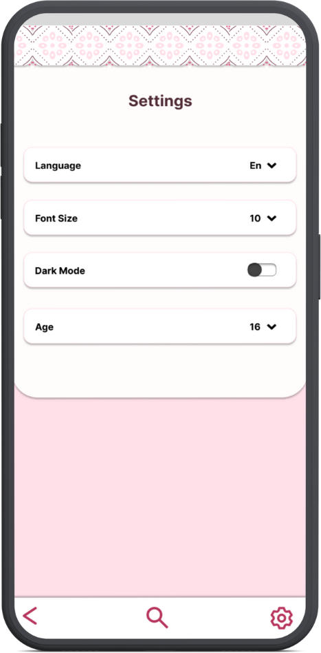

# Glow Girl

This app was developed by @SheidaRa, @traceytreat, and @emkerber during a hackathon hosted by [Hack the Gap](https://www.hackthegap.com/) on April 27th and 28th, 2024. It won first place!

## Purpose

Glow Girl is a unique women's health website designed for confidentiality and accessibility. With security features and multilingual translations, accessing information is safer and more private. Plus, Glow Girl is also available as a Progressive Web App, so you can download the website directly onto your device;  in cultures where discussing these topics can be difficult, your privacy is ensured.
 
Our goal? To empower women by offering a secure and convenient space for accessing essential health resources.

## Impact

- People of all ages
- Those prioritizing confidential health information
- Women in culturally sensitive environments
- Anyone interested in women's health

## Security

- The app logo is ambiguous, so it’s not obvious what the app is about 
- The web app can be downloaded directly onto your device

## Future features

- Quickly blacken the screen by double-tapping
- Auto-delete the browser history every minute
- More accessibility considerations, such as dark mode and increased font size
- Support for languages other than English
- Even more security features
- Finding investors and building a team to create an adequate API regarding women’s health

## Technologies and tools used

- React
- Progressive Web App
- Redux
- Bootstrap
- Figma
- Canva
- Trello

## Figma mockups (mobile and desktop views)

Our data came from https://www.plannedparenthood.org/learn.